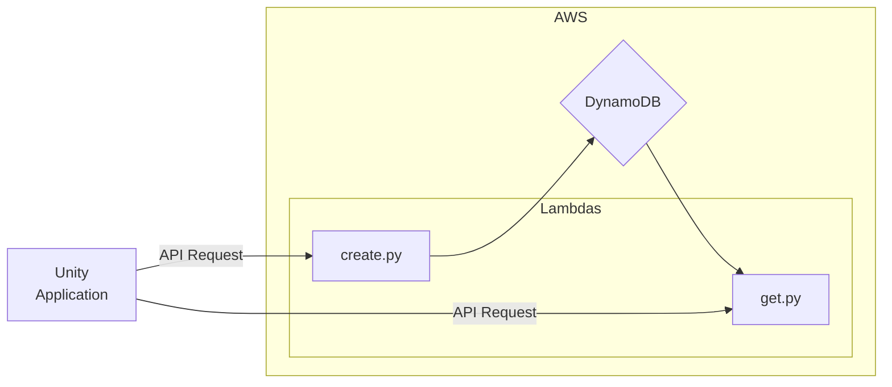

# quiz-app-backend

Serverless backend for [quiz-app](https://github.com/LTYGUY/quiz-app) :)

## Architecture

```mermaid
graph LR
    subgraph AWS
        subgraph Lambdas
            get[get.py]
            create[create.py]
        end

        db{DynamoDB}
        db --> get
        create --> db
    end

    UnityApp[Unity<br>Application] 
    UnityApp -->|API Request| get
    UnityApp -->|API Request| create
```
